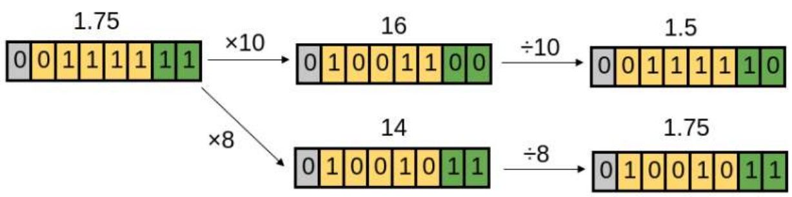

# NAS

Network Architecture Search

---

:tangerine:  [**Zen-NAS**](https://arxiv.org/pdf/2102.01063.pdf)  :date:   2021.02.01v1    :blush:  Alibaba

Zen-NAS: A Zero-Shot NAS for High-Performance Deep Image Recognition

#### 技术细节

Zen-score 不预测模型精度，而是直接推断网络模型复杂度，不训练参数。深学习理论的最新进展表明，网络模型复杂度与它在目标数据集上的准确性呈正相关。

神经架构搜索 （NAS） 方法是设计预测精度高、推理成本低的高性能深度神经网络的任务。

大多数 NAS 算法有两个关键组件：架构生成器和精度预测器。生成器提出潜在的高性能网络，并要求预测器预测其准确率。生成器主要方法包括统一采样，进化算法和强化学习。精度预测器比生成器更关键。低质量预测器可能会搜索到错误的方向。因此，几乎所有 NAS 算法都花费大量计算来构建高质量的精度预测器。

NAS早期研究中，使用蛮力算法预测精度。该方法直接训练查询网络以获得其准确性。暴力算法在一次搜索中需要数百到数千天GPU。

为解决这个问题，更有效的方法:

一种方法是参数化设计空间，使设计空间中的每个网络都由矢量编码。

然后，对目标数据集进行一些地标性网络训练，以获取其可达到的统计信息。

然后通过拟合精度结构对来学习精度预测器。

然而，这些方法仍然需要训练相当数量的网络，以足够高的精度。

另一种方法是构建一个超级网络，其中包含设计空间中所有可能的子网，如DART,  OFANet.

这些方法被称为单次方法，因为它们通过梯度下降优化超级网。

要回答给定子网络的查询，精度预测器使用超级网络参数作为初始化评估子网络。

这种参数共享方法将搜索成本降低至几十或 0000 GPU 小时，同时实现与暴力方法生成的竞争精度。

尽管上述方法取得了巨大成功，但训练超级网本身仍然非常昂贵。

为了在搜索空间中包括所有体系结构，超级网通常为 20∼比目标网络大 30 倍。

体重分担的一个令人恼火的副作用是模型干扰, 导致精度预测器退化。

此外，由于超级网络必须比目标网络大得多，因此很难搜索高精度大容量目标网络。

在这项工作中，我们考虑一种不同的方法。由于学习或构建精度预测变量成本高昂，建议用一些易于计算的索引替换精度预测变量。

方法受到深度学习理论最近进展的启发，深度模型的准确性与其模型复杂性密切相关：较大的模型复杂性表示在提供足够大的训练数据集时，泛化误差较小。

这个理论成果似乎与大规模的深入学习实践非常一致，尤其是对于大型和深度模型。

基于上述结果，我们设计了一个新的索引名称Zen-score，以取代NAS中的精度预测器。

Zen-score 测量深度神经网络的模型复杂性，而不是预测其准确性。

它适用于任何*香草卷积神经网络（VCN*网络）。

Zen-score 的计算只需要使用随机高斯输入在随机初始化网络上进行一些向前推论，使其速度极快且轻量级。

值得注意的是，禅宗得分是免疫的现象，我们*称之为模型崩溃*造成的批化（BN）层。

将禅宗得分与进化算法相结合，我们获得了一种名为Zen-NAS的新颖NAS算法。

我们将 Zen-NAS 分类为零镜头方法，因为它在搜索过程中不会优化网络参数^1^^1^显然，在部署之前，必须先在目标数据集上训练最终建立的体系结构。

我们应用 Zen-NAS 在各种推理预算下搜索最佳网络，包括推理延迟、FLOP（浮点操作）和模型大小。

产生的网络称为 ZenNets，在 CIFAR10/CIFAR100/ImageNet 上实现了最先进的 （SOTA） 性能，远胜于之前人工设计和 NAS 设计的型号。

为了测量网络的模型复杂性，我们要求网络是 VCN 网络。VCN网络空间涵盖许多以前手动设计或NAS设计的网络，包括 ResNet，MobileNet（Pham等人[，2018](https://www.arxiv-vanity.com/papers/2102.01063/#S1.p7 "Efficient Neural Architecture Search via Parameters Sharing")年），FBNet（Wan等人[，2020](https://www.arxiv-vanity.com/papers/2102.01063/#S1.p3 "FBNetV2: Differentiable Neural Architecture Search for Spatial and Channel Dimensions")年）和更多（Levine等人[，2020年](https://www.arxiv-vanity.com/papers/2102.01063/#S1.p5 "Limits to Depth Efficiencies of Self-Attention");蔡等人[，2020年](https://www.arxiv-vanity.com/papers/2102.01063/#A3.p1 "Once-for-All: Train One Network and Specialize it for Efficient Deployment on Diverse Hardware Platforms");胡等人， [2018）](https://www.arxiv-vanity.com/papers/2102.01063/#S1.p7 "Squeeze-and-Excitation Networks")。然而，它不涵盖多分支网络，如D致网络（黄等人[，2017](https://www.arxiv-vanity.com/papers/2102.01063/#S1.p7 "Densely Connected Convolutional Networks")年），或具有不规则细胞结构的网络，这些网络通常首选于基于超级网的方法，如在（Ying等人[，2019](https://www.arxiv-vanity.com/papers/2102.01063/#S1.p4 "NAS-Bench-101: Towards Reproducible Neural Architecture Search")年）中使用的设计空间。

这种局限性主要是由于在不规则设计空间中测量模型复杂度的理论难度。

换句话说，Zen-NAS的主要目标是在常规和一般足够的搜索空间中寻找高效的结构，而不是在不规则和异构的搜索空间中。

从经验上来说，虽然我们的 ZenNet 在 VCN 网络空间中进行搜索，但它优于大多数在不规则设计空间中搜索的基于超网的 NAS 方法。

#### Reference

[Awesome Compression Papers ](https://github.com/chenbong/awesome-compression-papers)

[Awesome ML Model Compression](https://github.com/cedrickchee/awesome-ml-model-compression)

---

:tangerine:  [**HW-SW Blueprint for Flexible Deep Learning Acceleration**](https://arxiv.org/pdf/1807.04188.pdf)  :date:   2018.07.11v1    :blush:  UW / SJTU

A Hardware-Software Blueprint for Flexible Deep Learning Specialization

#### 技术细节

使用2的幂作为缩放因子: 减少舍入误差。

#### Reference

[Awesome Compression Papers ](https://github.com/chenbong/awesome-compression-papers)

[Awesome ML Model Compression](https://github.com/cedrickchee/awesome-ml-model-compression)
