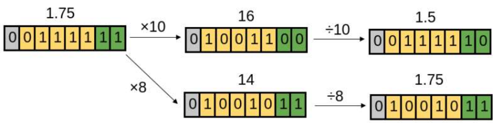

# model-optimization
model optimization, model compression, model pruning

#### Model Quantization

********
选择要量化的模型 : 准确率, 性能
Get a model to quantize
[ONNX resnet model](https://github.com/onnx/models/tree/main/vision/classification/resnet)

选择量化工具进行量化 :  
[Intel : ONNX Qunatization](https://github.com/intel/neural-compressor/blob/master/examples/onnxrt/image_recognition/onnx_model_zoo/resnet50/quantization/ptq/README.md)

#### Model Optimization

********
:tangerine:  [**APS**](https://arxiv.org/pdf/1911.08907.pdf)  :date:   2016.09.12v1    :blush:  Google Deepmind

Auto-Precision Scaling for Distributed Deep Learning

#### 技术细节

使用2的幂作为缩放因子: 减少舍入误差。

#### Reference 

[Awesome Compression Papers ](https://github.com/chenbong/awesome-compression-papers)

[Awesome ML Model Compression](https://github.com/cedrickchee/awesome-ml-model-compression)

********
:tangerine:  [**HW-SW Blueprint for Flexible Deep Learning Acceleration**](https://arxiv.org/pdf/1807.04188.pdf)  :date:   2018.07.11v1    :blush:  UW / SJTU

A Hardware-Software Blueprint for Flexible Deep Learning Specialization

#### 技术细节

使用2的幂作为缩放因子: 减少舍入误差。

#### Reference 

[Awesome Compression Papers ](https://github.com/chenbong/awesome-compression-papers)

[Awesome ML Model Compression](https://github.com/cedrickchee/awesome-ml-model-compression)

